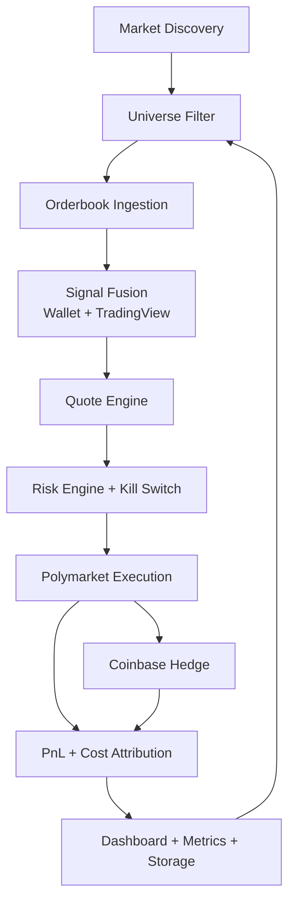

# System Architecture

## Runtime Topology
- Single process (`pt-engine`) on one host.
- Async tasks: discovery, wallet refresh, books, quote loop, watchdog, dashboard, optional TradingView listener.

## State/Storage
- SQLite (WAL): snapshots, execution reports, risk events.
- Parquet roll files: snapshot archives.
- In-memory rolling buffers: orderbooks, executions, per-market history.
